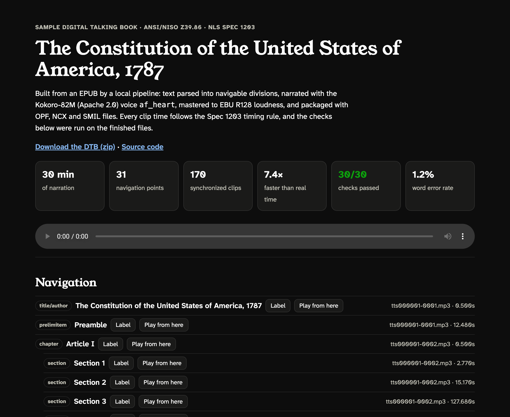

# TTS Talking Book

Turns an EPUB into a DAISY digital talking book (ANSI/NISO Z39.86) narrated by a synthetic voice, built to the file rules of NLS Specification 1203, the Library of Congress construction spec for talking books. No human step between the EPUB and the finished book.

The voice is Kokoro-82M (Apache 2.0). It runs on a laptop CPU, with no per-use fee and no outside service.

**Listen and inspect the sample: https://howlshot.github.io/tts-talking-book/**



## The sample

The U.S. Constitution (public domain, from Project Gutenberg), built in about 5 minutes:

| | |
|---|---|
| Narration | 29.6 minutes in 8 audio files, plus a headings file |
| Navigation | 31 points: title, Preamble, 7 Articles, 21 Sections, closing |
| Synchronization | 170 SMIL clips |
| Speed | 7.4× faster than real time, CPU only (Apple M5 Max) |
| Checks | 30 of 30 pass |
| Clip timing | All 203 clips (170 in the book, 33 heading labels) within the Spec 1203 windows, measured from the audio |
| Loudness | -18.1 to -18.4 LUFS on every file (EBU R128) |
| Intelligibility | 1.2% word error rate when the audio is transcribed back |

## How it works

```
talkingbook/source.py    EPUB in reading order -> title, front matter, chapters, sections
talkingbook/speech.py    pronunciation lexicon, sentence splitting, the Kokoro voice
talkingbook/audio.py     tracks with controlled silence; loudness; mono constant-bitrate encoding
talkingbook/dtb.py       OPF, NCX, SMIL and checksum files
talkingbook/validate.py  the 30 checks
talkingbook/asr.py       transcribes each track with whisper.cpp and scores it against the text
```

- **Clip timing holds by construction.** Each sentence is trimmed to its speech and placed with silence the builder controls, so every clip starts 100 ms before the voice and ends 200 ms after it. Spec 1203 §3.3.4.2 asks for 80–120 ms and 150–300 ms. The validator then measures this from the audio, separately.
- **Checked offline against the DTDs.** The OPF, NCX, SMIL and checksum files are validated with xmllint against DTDs bundled in the book. Other checks cover file names, navPoint classes, totalTime, the manifest and checksums.
- **Pronunciation fixes are logged.** 22 rules turn "Wm." into "William", "chuse" into "choose", and so on. Each hit is listed on the sample page.
- **Intelligibility is measured.** Each track is transcribed and compared with the text the voice was given. Most remaining differences are numbers written as digits, sound-alikes (marque, mark), 1787 spellings and signers' names.

## Limits

- Audio is MP3, which Z39.86 allows. NLS delivery needs AMR-WB+ in 3GP (Spec 1203 §3.2.3).
- No PDTB2 encryption (NLS Spec 1205).
- Built to Z39.86-2005; Spec 1203 cites the 2002 version.
- Tested in the browser and by validation, not on NLS players. One voice, one book.

## Run it

Needs Python 3.12, ffmpeg, xmllint, and whisper-cli (whisper.cpp) with the `ggml-small.en` model for the intelligibility check.

```bash
pip install -r requirements.txt
python -m talkingbook build sources/constitution.json --out build
python -m unittest discover tests
```

The EPUB is not in the repo: download Project Gutenberg ebook #5 as EPUB and save it as `sources/constitution-pg5.epub`. The tests need no voice model; one builds a small book with tone bursts in place of speech and runs every check on it.

## License

Code: MIT. Text: public domain. Voice: Kokoro-82M, Apache 2.0. The bundled DTDs are from the DAISY Consortium (Z39.86-2005) and the Open eBook Forum (OEB 1.2).

Built by [Studio Chingie LLC](https://studiochingie.com/services).
